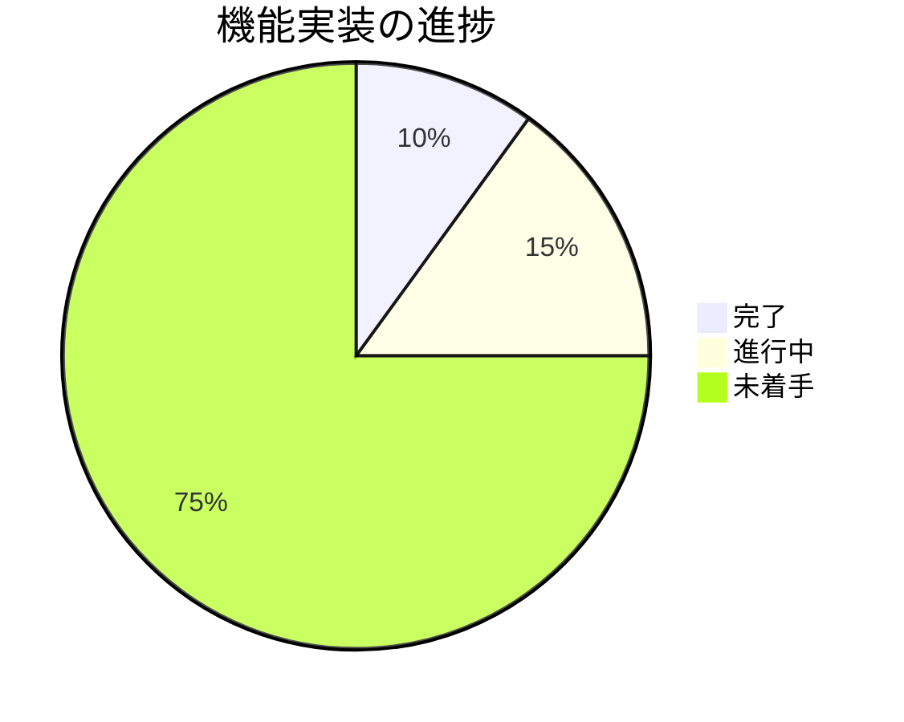

# AvailableX 進捗状況

## 現在のステータス
プロジェクトは**初期開発フェーズ**にあります。基本的なプロジェクト構造は設定されていますが、コア機能の実装はこれから行う必要があります。

### 進捗概要

## 完了した項目
- ✅ プロジェクトの初期化（Next.js + TypeScript + Tailwind CSS）
- ✅ 基本的な依存関係の設定
- ✅ プロジェクト要件の定義
- ✅ データ形式の設計（URL用エンコーディング形式）
- ✅ プロジェクト構造の計画
- ✅ 詳細仕様の決定（週表示、15分単位、ライト/ダークモードなど）

## 進行中の項目
- 🔄 コンポーネント構造の設計
- 🔄 型定義の作成
- 🔄 基本的なレイアウトの実装
- 🔄 必要なライブラリの追加（React Big Calendar, date-fns）

## 未着手の項目
- ⬜ カレンダーUIコンポーネントの実装（週表示ベース）
- ⬜ 15分単位の日時選択ロジックの開発
- ⬜ データストアの構築（React Context）
- ⬜ エンコード/デコードロジックの実装
- ⬜ テキスト表示コンポーネントの開発
- ⬜ URL生成機能の実装（クエリパラメータ）
- ⬜ ライト/ダークモード切替機能の実装
- ⬜ レスポンシブデザインの適用（モバイル対応）
- ⬜ ユニットテストの作成
- ⬜ ブラウザ互換性のテスト
- ⬜ パフォーマンス最適化

## 実装予定の機能リスト
1. **カレンダーUI**
   - [ ] 週表示をデフォルトとしたカレンダー表示
   - [ ] 15分単位のスロット表示
   - [ ] ドラッグ＆ドロップによる日時範囲選択
   - [ ] 選択範囲の視覚的表示
   - [ ] 選択範囲の編集/削除機能

2. **日時データ処理**
   - [ ] 日時範囲の内部データ構造
   - [ ] UTCベースのデータ管理
   - [ ] ローカルタイムゾーンでの表示
   - [ ] 日時のバリデーション

3. **エンコード/デコード**
   - [ ] URL用の効率的なエンコーディング
   - [ ] クエリパラメータとしての実装
   - [ ] エンコードされたデータのデコード
   - [ ] エラー処理とフォールバック

4. **テキスト表示**
   - [ ] 「2025年3月26日(水) 13:00-15:00」形式での表示
   - [ ] コピー機能
   - [ ] 将来的な複数表示形式対応の基盤

5. **URL生成と共有**
   - [ ] 共有可能なPermalink生成
   - [ ] クリップボードへのコピー機能
   - [ ] QRコード生成（将来機能）

6. **UI/UX**
   - [ ] レスポンシブデザイン（モバイル対応）
   - [ ] ライト/ダークモード切替（UIボタンで切替）
   - [ ] アニメーションとトランジション
   - [ ] iPhoneでの操作性最適化

## 既知の問題
1. **React Big Calendarのカスタマイズ**
   - 週表示をデフォルトに設定
   - 15分単位のスロット表示の実装
   - ドラッグ＆ドロップ機能の実装方法の検討

2. **URLの長さ制限**
   - 多数の日時範囲を選択した場合のURLの長さ制限
   - 効率的なエンコーディング方式の開発が必要

3. **ブラウザ互換性**
   - 異なるブラウザでの一貫した動作の確保
   - モバイルデバイスでのタッチインタラクションの最適化

4. **タイムゾーン対応**
   - UTCベースのデータとローカルタイムゾーン表示の整合性確保
   - 異なるタイムゾーンのユーザー間での共有時の表示調整

## 次のマイルストーン
### マイルストーン1: 基本機能の実装（目標: 2週間以内）
- [ ] 必要なライブラリのインストール（React Big Calendar, date-fns）
- [ ] プロジェクト構造の完成（App Router対応）
- [ ] 週表示ベースのカレンダーUIの基本実装
- [ ] 15分単位の日時選択機能の実装
- [ ] データストアの構築（React Context）

### マイルストーン2: コア機能の完成（目標: 4週間以内）
- [ ] エンコード/デコードロジックの実装
- [ ] 「2025年3月26日(水) 13:00-15:00」形式でのテキスト表示
- [ ] URL生成機能の実装（クエリパラメータ）
- [ ] クリップボードへのコピー機能

### マイルストーン3: UI/UXの洗練（目標: 6週間以内）
- [ ] レスポンシブデザインの完成（モバイル対応）
- [ ] ライト/ダークモード切替機能の実装
- [ ] ユニットテストの作成
- [ ] ブラウザ互換性のテスト
- [ ] パフォーマンス最適化

## リスクと対策
| リスク | 影響度 | 対策 |
|-------|-------|------|
| React Big Calendarのカスタマイズ難易度 | 中 | 早期にプロトタイプを作成し、必要に応じて代替ライブラリを検討 |
| URLの長さ制限 | 高 | 効率的なエンコーディング方式の開発、エンコーダ/デコーダを関数に切り出して拡張性を確保 |
| ブラウザ互換性の問題 | 中 | クロスブラウザテスト、ポリフィルの使用、レスポンシブデザインの徹底 |
| タイムゾーン対応の複雑さ | 中 | date-fnsを活用したタイムゾーン変換の実装、UTCベースのデータ管理 |
