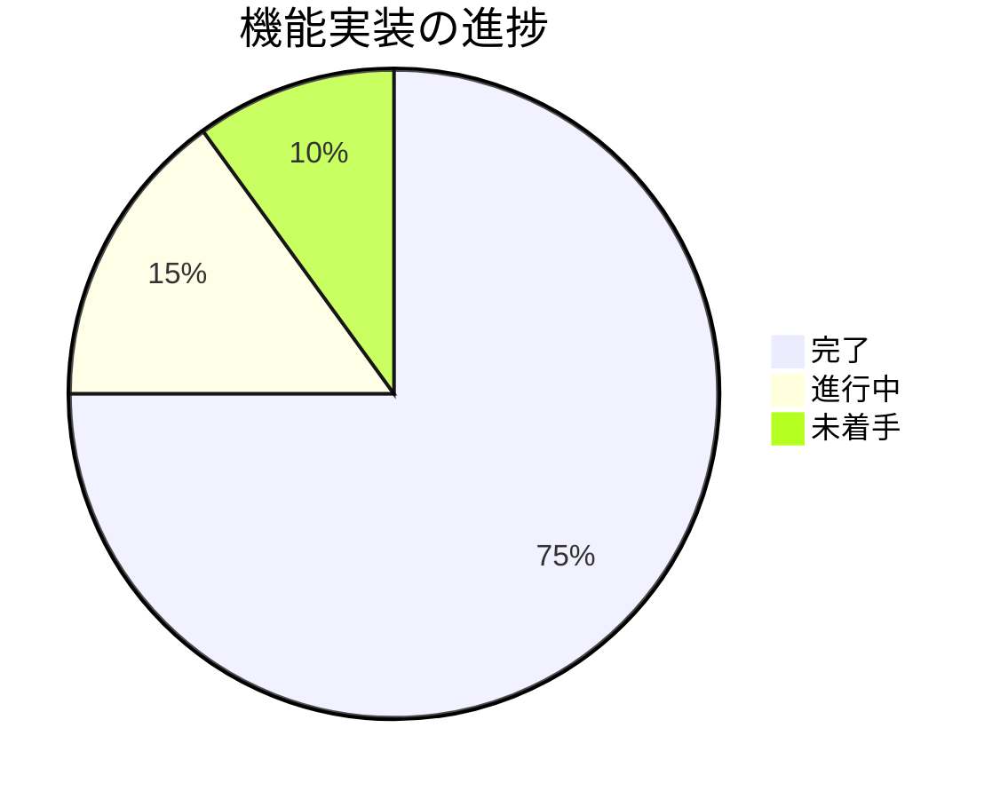

# AvailableX 進捗状況

## 現在のステータス
プロジェクトは**基本実装完了フェーズ**にあります。コア機能の実装が完了し、今後は機能拡張とUI/UXの改善に焦点を当てます。

### 進捗概要


## 完了した項目
- ✅ プロジェクトの初期化（Next.js + TypeScript + Tailwind CSS）
- ✅ 基本的な依存関係の設定
- ✅ プロジェクト要件の定義
- ✅ データ形式の設計（URL用エンコーディング形式）
- ✅ プロジェクト構造の計画
- ✅ 詳細仕様の決定（週表示、15分単位、ライト/ダークモードなど）
- ✅ コンポーネント構造の設計
- ✅ 型定義の作成
- ✅ 基本的なレイアウトの実装
- ✅ 必要なライブラリの追加（React Big Calendar, date-fns）
- ✅ カレンダーUIコンポーネントの実装（週表示ベース）
- ✅ 15分単位の日時選択ロジックの開発
- ✅ データストアの構築（React Context）
- ✅ エンコード/デコードロジックの実装
- ✅ テキスト表示コンポーネントの開発
- ✅ URL生成機能の実装（クエリパラメータ）
- ✅ ライト/ダークモード切替機能の実装
- ✅ レスポンシブデザインの適用（基本的なモバイル対応）

## 進行中の項目
- 🔄 モバイル操作性の最適化
- 🔄 ブラウザ互換性のテスト
- 🔄 パフォーマンス最適化

## 未着手の項目
- ⬜ QRコード生成機能の実装
- ⬜ 複数言語対応の基盤整備
- ⬜ アニメーションとトランジションの追加
- ⬜ ユニットテストの作成
- ⬜ CI/CDパイプラインの構築

## 実装済みの機能リスト
1. **カレンダーUI**
   - [x] 週表示をデフォルトとしたカレンダー表示
   - [x] 15分単位のスロット表示
   - [x] ドラッグ＆ドロップによる日時範囲選択
   - [x] 選択範囲の視覚的表示
   - [x] 選択範囲の編集/削除機能

2. **日時データ処理**
   - [x] 日時範囲の内部データ構造
   - [x] UTCベースのデータ管理
   - [x] ローカルタイムゾーンでの表示
   - [x] 日時のバリデーション

3. **エンコード/デコード**
   - [x] URL用の効率的なエンコーディング
   - [x] クエリパラメータとしての実装
   - [x] エンコードされたデータのデコード
   - [x] エラー処理とフォールバック

4. **テキスト表示**
   - [x] 「2025年3月26日(水) 13:00-15:00」形式での表示
   - [x] コピー機能
   - [ ] 将来的な複数表示形式対応の基盤

5. **URL生成と共有**
   - [x] 共有可能なPermalink生成
   - [x] クリップボードへのコピー機能
   - [ ] QRコード生成（将来機能）

6. **UI/UX**
   - [x] レスポンシブデザイン（モバイル対応）
   - [x] ライト/ダークモード切替（UIボタンで切替）
   - [ ] アニメーションとトランジション
   - [ ] iPhoneでの操作性最適化

## 既知の問題と今後の課題
1. **React Big Calendarのさらなるカスタマイズ**
   - より直感的な操作性の実現
   - モバイルでのドラッグ＆ドロップ操作の最適化

2. **URLの長さ制限**
   - 多数の日時範囲を選択した場合のURLの長さ制限
   - より効率的なエンコーディング方式の検討

3. **ブラウザ互換性**
   - 異なるブラウザでの一貫した動作の確保
   - モバイルデバイスでのタッチインタラクションの最適化

4. **タイムゾーン対応の強化**
   - UTCベースのデータとローカルタイムゾーン表示の整合性確保
   - 異なるタイムゾーンのユーザー間での共有時の表示調整

## 次のマイルストーン
### マイルストーン1: 基本機能の実装 ✅
- [x] 必要なライブラリのインストール（React Big Calendar, date-fns）
- [x] プロジェクト構造の完成（App Router対応）
- [x] 週表示ベースのカレンダーUIの基本実装
- [x] 15分単位の日時選択機能の実装
- [x] データストアの構築（React Context）

### マイルストーン2: コア機能の完成 ✅
- [x] エンコード/デコードロジックの実装
- [x] 「2025年3月26日(水) 13:00-15:00」形式でのテキスト表示
- [x] URL生成機能の実装（クエリパラメータ）
- [x] クリップボードへのコピー機能

### マイルストーン3: UI/UXの洗練（目標: 2週間以内）
- [x] レスポンシブデザインの基本実装
- [x] ライト/ダークモード切替機能の実装
- [ ] モバイル操作性のさらなる最適化
- [ ] ブラウザ互換性のテスト
- [ ] パフォーマンス最適化

### マイルストーン4: 機能拡張（目標: 4週間以内）
- [ ] QRコード生成機能の実装
- [ ] 複数言語対応の基盤整備
- [ ] アニメーションとトランジションの追加
- [ ] ユニットテストの作成
- [ ] CI/CDパイプラインの構築

## リスクと対策
| リスク | 影響度 | 対策 |
|-------|-------|------|
| React Big Calendarのさらなるカスタマイズ難易度 | 中 | コンポーネントの拡張方法を調査し、必要に応じてカスタムコンポーネントの開発を検討 |
| URLの長さ制限 | 高 | より効率的なエンコーディング方式の開発、必要に応じて圧縮アルゴリズムの検討 |
| ブラウザ互換性の問題 | 中 | クロスブラウザテスト、ポリフィルの使用、レスポンシブデザインの徹底 |
| タイムゾーン対応の複雑さ | 中 | date-fnsを活用したタイムゾーン変換の実装、UTCベースのデータ管理の強化 |

## プロジェクト構造
```
availablex/
├── src/
│   ├── app/
│   │   ├── globals.css      # グローバルスタイル（ダークモード対応）
│   │   ├── layout.tsx       # アプリケーションレイアウト
│   │   └── page.tsx         # メインページ
│   ├── components/
│   │   ├── App.tsx          # アプリケーションのメインコンポーネント
│   │   ├── Calendar.tsx     # カレンダーコンポーネント
│   │   ├── ScheduleContext.tsx # 状態管理コンテキスト
│   │   ├── TextDisplay.tsx  # テキスト表示コンポーネント
│   │   └── ThemeToggle.tsx  # テーマ切替コンポーネント
│   ├── lib/
│   │   ├── encode.ts        # エンコードロジック
│   │   └── decode.ts        # デコードロジック
│   ├── types/
│   │   └── schedule.ts      # 型定義
│   └── utils/
│       └── format.ts        # フォーマット関数
└── tailwind.config.js       # Tailwind設定（ダークモード対応）
```
