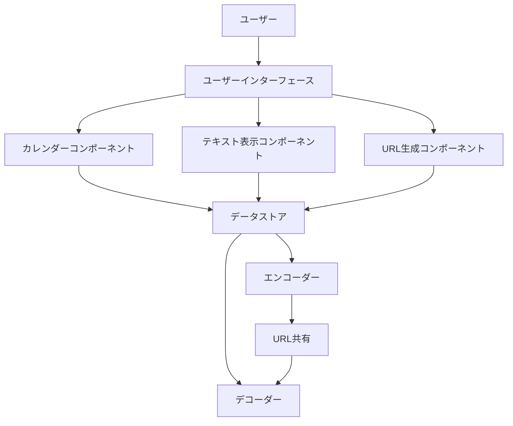
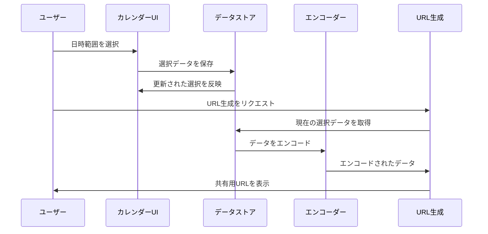

# AvailableX システムパターン

## アーキテクチャ概要
AvailableXは、Next.jsをベースとしたクライアントサイドのみで動作するシングルページアプリケーション（SPA）です。サーバーサイドの処理は最小限に抑え、ほとんどの機能をクライアントブラウザ上で実行します。この設計により、サーバーコストを削減し、プライバシーを重視した実装が可能になっています。



## コアコンポーネント（実装済み）
1. **カレンダーコンポーネント（Calendar.tsx）**
   - React Big Calendarを使用
   - 日時範囲の選択と視覚化を担当
   - ドラッグ＆ドロップによる範囲選択機能を実装
   - 15分単位のスロット表示

2. **データストア（ScheduleContext.tsx）**
   - 選択された日時範囲を管理
   - React Context + useReducerを使用してアプリケーション全体で状態を共有
   - 日時データの追加、削除、更新機能を提供
   - テーマ設定（ライト/ダーク）の管理

3. **エンコーダー/デコーダー（encode.ts/decode.ts）**
   - 日時データをURL用に圧縮/展開
   - 効率的なデータ形式変換を担当
   - URLクエリパラメータとの相互変換を実装
   - エラー処理とフォールバック機能

4. **テキスト表示コンポーネント（TextDisplay.tsx）**
   - 選択された日時範囲を人間が読みやすい形式で表示
   - テキストコピー機能を提供
   - 将来的な多言語対応の基盤を準備

5. **URL生成コンポーネント（TextDisplay.tsx内に実装）**
   - 共有可能なPermalinkを生成
   - クリップボードへのコピー機能を提供
   - 将来的なQRコード生成オプションを検討

6. **テーマ切替コンポーネント（ThemeToggle.tsx）**
   - ライト/ダークモードの切替機能
   - Tailwind CSSの'class'モードを使用
   - アクセシビリティに配慮したUI

## データフロー


## 状態管理パターン
1. **React Context + useReducer**
   - グローバル状態の管理に使用
   - 複雑な状態遷移を整理するためのReducerパターン
   - 不要な再レンダリングを防ぐためのメモ化戦略

2. **イミュータブルデータパターン**
   - 状態の変更は常に新しいオブジェクトを生成
   - 予測可能な状態変更と履歴追跡が容易
   - デバッグとテストの簡素化

## URL処理パターン
1. **クエリパラメータベースの状態保存**
   - アプリケーションの状態をURLに埋め込み
   - ブックマーク可能で共有しやすい設計
   - URLからの状態復元機能

2. **効率的なエンコーディング**
   - 日時データを最小限のテキストに圧縮
   - URLの長さ制限を考慮した設計
   - デコード時の堅牢性を確保

## レスポンシブデザインパターン（実装済み）
1. **モバイルファースト**
   - 小さい画面サイズから設計を開始
   - 段階的に大きな画面サイズに対応
   - タッチインターフェースを優先

2. **コンポーネントの適応的レイアウト**
   - 画面サイズに応じてレイアウトを変更
   - Tailwind CSSのユーティリティクラスを活用
   - 一貫したユーザー体験を維持
   - グリッドレイアウトによる効率的な空間利用

## エラー処理パターン（実装済み）
1. **境界エラーコンポーネント**
   - React Error Boundariesを使用
   - コンポーネントレベルでのエラー封じ込め
   - ユーザーフレンドリーなエラーメッセージ

2. **フォールバックUI**
   - データ読み込み中や処理中の状態表示
   - エラー発生時の代替UI提供
   - URLデコード失敗時のデフォルト状態への回復

## 実装されたファイル構造
```
availablex/
├── src/
│   ├── app/
│   │   ├── globals.css      # グローバルスタイル（ダークモード対応）
│   │   ├── layout.tsx       # アプリケーションレイアウト
│   │   └── page.tsx         # メインページ
│   ├── components/
│   │   ├── App.tsx          # アプリケーションのメインコンポーネント
│   │   ├── Calendar.tsx     # カレンダーコンポーネント
│   │   ├── ScheduleContext.tsx # 状態管理コンテキスト
│   │   ├── TextDisplay.tsx  # テキスト表示コンポーネント
│   │   └── ThemeToggle.tsx  # テーマ切替コンポーネント
│   ├── lib/
│   │   ├── encode.ts        # エンコードロジック
│   │   └── decode.ts        # デコードロジック
│   ├── types/
│   │   └── schedule.ts      # 型定義
│   └── utils/
│       └── format.ts        # フォーマット関数
└── tailwind.config.js       # Tailwind設定（ダークモード対応）
```

## 今後の拡張ポイント
1. **QRコード生成機能**
   - TextDisplayコンポーネントに追加予定
   - 外部ライブラリの活用を検討

2. **多言語対応**
   - formatユーティリティの拡張
   - 言語切替機能の実装

3. **アニメーションとトランジション**
   - ユーザー操作に対するビジュアルフィードバックの強化
   - Framer Motionなどのライブラリの検討
